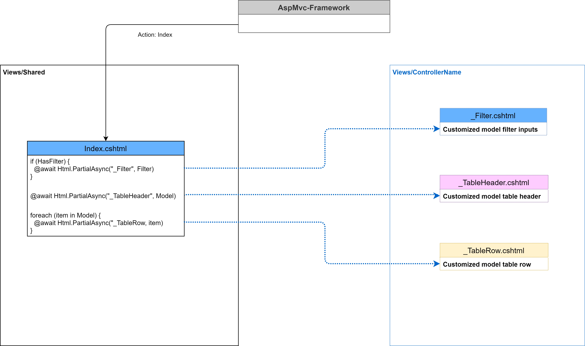
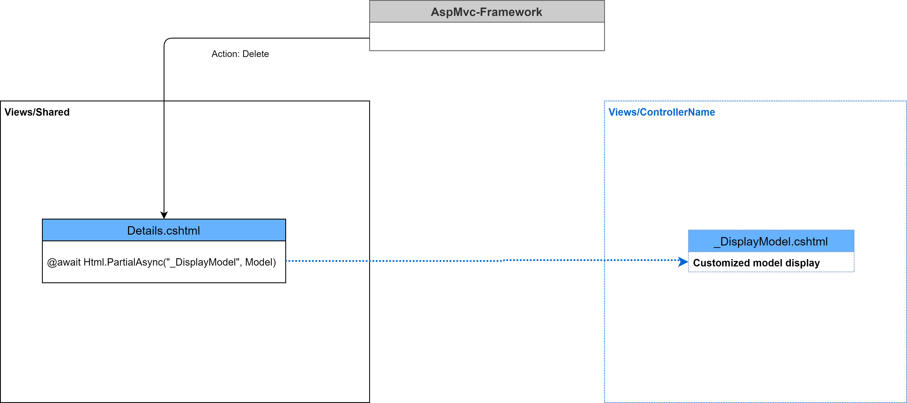

# Vordefinierte AspMvc-Views

## Default Index View

Die Index-View im Bereich *'Views/Shared'* ist eine Standard-View fuer die Uebersichts-Seite von Modellen. Diese Ansicht unterstuetzt 3 Arten von Teil-Ansichten welche fuer das entsprechende Model angepasst werden muessen. Die Teil-Ansicht *'_Filter.cshtml'* ist optional und muss nicht bereit gestellt werden. Die anderen beiden Teil-Ansichten *'_TableHeader.cshtml'* und *'_TableRow.cshtml'* muessen hingegen im konkreten *'Views/ControllerName'* bereitgestellt werden. In der nachfolgenden Skizze ist der Aufbau der Uebersichts-Seite schematisch skizziert:  

  

### Ein Beispiel fuer die Verwendung der Default Index Ansicht

Im folgenden wird die Verwendung der Standard-Index-Ansicht fuer das Model *'Person'* mit Filter demonstriert.

#### Das Model *'Person'*  

```csharp  
namespace ...Models
{
    public class Person : IdentityModel
    {
        public string? FirstName { get; set; };
        public string? LastName { get; set; };
    }
}
```  

#### Das Model *'FilterModel'*

```csharp  
namespace ...Models
{
    public class PersonFilter
    {
        public bool HasValue => string.IsNullOrEmpty(FirstName) == false || string.IsNullOrEmpty(LastName) == false;
        public string? FirstName { get; set; }
        public string? LastName { get; set; }

        public override string ToString()
        {
            return $"Firstname: {(string.IsNullOrEmpty(FirstName) == false ? FirstName : "---")} Lastname: {(string.IsNullOrEmpty(LastName) == false ? LastName : "---")}";
        }
    }
}
```  
#### Die Ansicht *_TableHeader.cshtml* im Ordner */Views/Person*

```csharp  
@model IEnumerable<...Models.Person>

<thead>
    <tr>
        <th>
            @Html.DisplayNameFor(model => model.FirstName)
        </th>
        <th>
            @Html.DisplayNameFor(model => model.LastName)
        </th>
        <th></th>
    </tr>
</thead>
```  

#### Die Ansicht *_TableRow.cshtml* im Ordner */Views/Person*

```csharp  
@model ...Models.Person

<tr>
    <td>
        @Html.DisplayFor(model => model.FirstName)
    </td>
    <td>
        @Html.DisplayFor(model => model.LastName)
    </td>
    <td>
        @Html.ActionLink("Edit", "Edit", new { id=Model.Id }) |
        @Html.ActionLink("Details", "Details", new { id=Model.Id }) |
        @Html.ActionLink("Delete", "Delete", new { id=Model.Id })
    </td>
</tr>
```  

Nun kann die Standard-Index-Ansicht ohne Filter verwendet werden. Fuer die Verwendung mit Filter sind weitere Schritte notwendig. Die zusaetzlichen Schritte sind nachfolgen definiert.  

#### Erweiterung des Kontrollers *'PersonsController'* fuer die Filter-Funktion

```csharp  
namespace ...Controllers
{
    public class PersonsController : GenericController<Logic.Entities.Person, Models.Person>
    {
        private string FilterName => typeof(Models.PersonFilter).Name;
        public PersonsController(Logic.IDataAccess<Logic.Entities.Person> dataAccess) : base(dataAccess)
        {
        }

        public override async Task<IActionResult> Index()
        {
            IActionResult? result;
            var filter = SessionWrapper.Get<Models.PersonFilter>(FilterName) ?? new Models.PersonFilter();

            if (filter.HasValue)
            {
                var instanceDataAccess = DataAccess as Logic.Controllers.PersonsController;
                var accessModels = await instanceDataAccess!.QueryByAsync(filter.FirstName, filter.LastName);

                result = View(AfterQuery(accessModels).Select(e => ToViewModel(e, ActionMode.Index)));
            }
            else
            {
                var accessModels = await DataAccess.GetAllAsync();

                result = View(AfterQuery(accessModels).Select(e => ToViewModel(e, ActionMode.Index)));
            }

            ViewBag.Filter = filter;
            return result;
        }

        public async Task<IActionResult> Filter(Models.PersonFilter filter)
        {
            IActionResult? result;

            if (filter.HasValue)
            {
                var instanceDataAccess = DataAccess as Logic.Controllers.PersonsController;
                var accessModels = await instanceDataAccess!.QueryByAsync(filter.FirstName, filter.LastName);

                result = View("Index", AfterQuery(accessModels).Select(e => ToViewModel(e, ActionMode.Index)));
            }
            else
            {
                result = RedirectToAction("Index");
            }

            ViewBag.Filter = filter;
            SessionWrapper.Set<Models.PersonFilter>(FilterName, filter);
            return result;
        }
    }
}
```  

Die Kontroller-Klasse `PersonsController` in der Logic ist um die Abfrage `QueryByAsync(...)` erweitert. Die Implementierung fuer diese Abfrage ist in der Klasse ist wie folgt definiert:

```csharp  
namespace ...Controllers
{
    public sealed partial class PersonsController : GenericController<Entities.Person>
    {
        public PersonsController()
        {
        }

        public PersonsController(ControllerObject other) : base(other)
        {
        }

        public Task<Entities.Person[]> QueryByAsync(string? firstName, string? lastName)
        {
            var query = EntitySet.AsQueryable();

            if (firstName != null)
            {
                query = query.Where(e => e.FirstName.Contains(firstName));
            }
            if (lastName != null)
            {
                query = query.Where(e => e.LastName.Contains(lastName));
            }
            return query.AsNoTracking().ToArrayAsync();
        }
    }
}
```  


#### Die Ansicht *_Filter.cshtml* im Ordner */Views/Person*

```csharp  
@model ...Models.PersonFilter

<div class="row">
    <div class="col-md-4">
        <form asp-action="Filter">
            <div asp-validation-summary="ModelOnly" class="text-danger"></div>
            <div class="form-group">
                <label asp-for="FirstName" class="control-label"></label>
                <input asp-for="FirstName" class="form-control" />
            </div>
            <div class="form-group">
                <label asp-for="LastName" class="control-label"></label>
                <input asp-for="LastName" class="form-control" />
            </div>
            <p></p>
            <div class="form-group">
                <input type="submit" value="Apply" class="btn btn-primary" />
            </div>
        </form>
    </div>
</div>
```  

## Default Create View  

  

### Die Ansicht *_EditModel* im Ordner */Views/Person*

```csharp  
@model ...Models.Person

<div class="row">
    <div class="col-md-4">
        <div asp-validation-summary="ModelOnly" class="text-danger"></div>
        <div class="form-group">
            <label asp-for="FirstName" class="control-label"></label>
            <input asp-for="FirstName" class="form-control" />
            <span asp-validation-for="FirstName" class="text-danger"></span>
        </div>
        <div class="form-group">
            <label asp-for="LastName" class="control-label"></label>
            <input asp-for="LastName" class="form-control" />
            <span asp-validation-for="LastName" class="text-danger"></span>
        </div>
    </div>
</div>
```  

## Default Edit View

  

### Die Ansicht *_EditModel* im Ordner */Views/Person*  

```csharp  
@model ...Models.Person

<div class="row">
    <div class="col-md-4">
        <div asp-validation-summary="ModelOnly" class="text-danger"></div>
        <div class="form-group">
            <label asp-for="FirstName" class="control-label"></label>
            <input asp-for="FirstName" class="form-control" />
            <span asp-validation-for="FirstName" class="text-danger"></span>
        </div>
        <div class="form-group">
            <label asp-for="LastName" class="control-label"></label>
            <input asp-for="LastName" class="form-control" />
            <span asp-validation-for="LastName" class="text-danger"></span>
        </div>
    </div>
</div>
```  

## Default Delete View

  

### Die Ansicht *_DisplayModel* im Ordner */Views/Person*  

```csharp  
@model ...Models.Person

<dl class="row">
    <dt class="col-sm-2">
        @Html.DisplayNameFor(model => model.FirstName)
    </dt>
    <dd class="col-sm-10">
        @Html.DisplayFor(model => model.FirstName)
    </dd>
    <dt class="col-sm-2">
        @Html.DisplayNameFor(model => model.LastName)
    </dt>
    <dd class="col-sm-10">
        @Html.DisplayFor(model => model.LastName)
    </dd>
</dl>
```  

## Default Details View

  

### Die Ansicht *_DisplayModel* im Ordner */Views/Person*  

```csharp  
@model ...Models.Person

<dl class="row">
    <dt class="col-sm-2">
        @Html.DisplayNameFor(model => model.FirstName)
    </dt>
    <dd class="col-sm-10">
        @Html.DisplayFor(model => model.FirstName)
    </dd>
    <dt class="col-sm-2">
        @Html.DisplayNameFor(model => model.LastName)
    </dt>
    <dd class="col-sm-10">
        @Html.DisplayFor(model => model.LastName)
    </dd>
</dl>
```  

Das Projekt zu diesem Dokument finden Sie unter: [GitHub-QTDemoDefaultViews](https://github.com/leoggehrer/CSSoftwareEngineering-QTDemoDefaultViews)

*Viel Erfolg beim Anwenden der Default-Views!*
