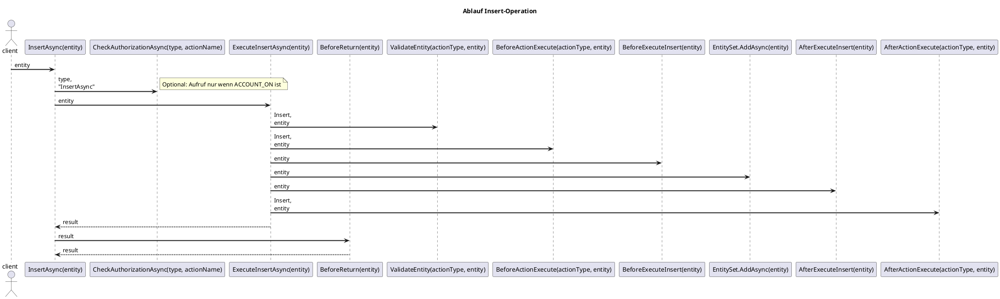

# Logic-Kontroller - CRUD Operations

## Insert einer Entitaet

```plantuml
@startuml
skinparam sequenceArrowThickness 2
skinparam maxmessagesize 60
skinparam monochrome false

title Ablauf Insert-Operation

'Das ist ein Kommentar
actor client
participant "InsertAsync(entity)" as insert
participant "CheckAuthorizationAsync(type, actionName)" as checkauth
participant "ExecuteInsertAsync(entity)" as execute
participant "BeforeReturn(entity)" as beforeret

client -> insert : entity
insert -> checkauth : type, "InsertAsync"
note right: Optional: Aufruf nur wenn ACCOUNT_ON ist
insert -> execute : entity

'Beginn: Ablauf ExecuteInsert(...)
execute -> "ValidateEntity(actionType, entity)" : Insert, entity
execute -> "BeforeActionExecute(actionType, entity)" : Insert, entity
execute -> "BeforeExecuteInsert(entity)" : entity
execute -> "EntitySet.AddAsync(entity)" : entity
execute -> "AfterExecuteInsert(entity)" : entity
execute -> "AfterActionExecute(actionType, entity)" : Insert, entity
'Ende: Ablauf ExecuteInsert(...)
execute --> insert : result

insert -> beforeret : result
return result
@enduml
```